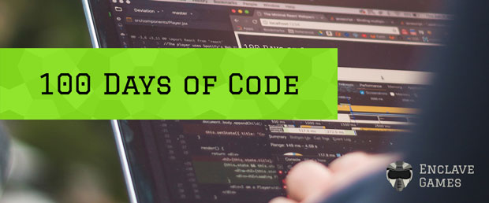

# My 100 Days of Code

I've started the **#100DaysOfCode** challenge on April 15th 2019, although I'm gonna bend the rules a bit to my needs - you can read the [initial blog post](https://dev.end3r.com/2019/04/my-100-days-of-code/) about my plans to learn about the details.

## Day 1: April 15th 2019

**Time spent**: 1h

**Today's Progress**: started with the Enclave Phaser Template, looked at a few Phaser 3 boilerplates.

**Thoughts:** well, right now I'm at the "I have no idea what I'm doing" stage with Phaser 3 as I haven't checked a single tutorial about it (yet), so "working on EPT" will be equal to "learning Phaser 3". It will take some time before I'll be able to publish something, but hey, at least I've finally started!

## Day 2: April 16th 2019

**Time spent**: TBD

**Today's Progress**: TBD

**Thoughts:** TBD